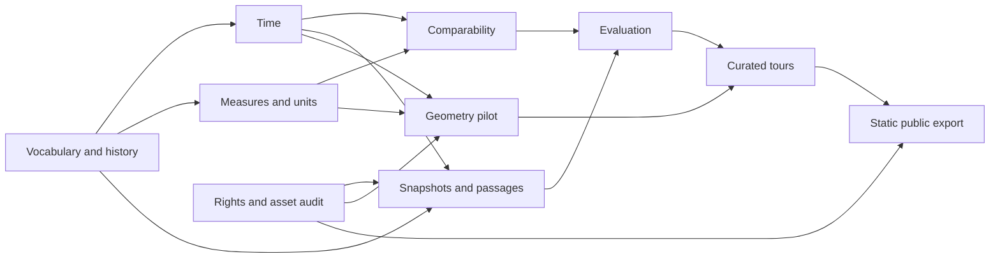

# Nexus technical design review

Analysis completed 2026-09-23 America/New_York (2026-09-24 UTC). **Recommendations, not accepted decisions or implementation.** All ten workstreams are covered. Only new files under `docs/recommendations/` were written; no application code, fixtures, tests, migrations or existing documents changed, no commits, installs, servers or deployments. The pasted attachment and repository brief were checked and contain the same text.

**Build the normalized evidence model before wiring data into the new visual foundation.** Keep original claim and review payloads intact; add versioned projections for terminology, time and measurements. The most consequential data gap is not corpus size: today's 11 metric groups contain 37 points with mixed measures, dates and category labels, without individual entity/source-version bindings. Tours, conflicts and timeline controls cannot safely infer those distinctions from titles.

The shipping-highway idea is useful as a **labelled model of possible paths**. Available routing libraries do not prove that a particular cargo took a path, and network/port data rights remain partly unresolved. Likewise, a min–max range is useful only across explicitly comparable reports, not as a universal uncertainty display.

## Documents and recommended order

| Order | Recommendation | Outcome / gate |
|---|---|---|
| 1 | [A: vocabularies](01-vocabularies.md) | All 44 claim mappings, source classifications, immutable-history migration path |
| 2 | [B: time](02-time-model.md) and [D: units](04-units-and-conversions.md) | Stable measurement identities, periods, definitions and source-version bindings |
| 3 | [C: conflicting sources](03-conflicting-sources.md) | Reviewed comparability and revision lineage; side-by-side default |
| Alongside foundations | [J: assets/licences](10-assets-and-licences.md), then [I: acquisition](09-acquisition-hardening.md) | Cleared foundation assets, snapshot/passage evidence and proposed quote repairs |
| 4 | [H: evaluation](08-evaluation-and-trust.md) | Deterministic gates and corrected oracles before models or automatic updates |
| 5 | [E: geometry](05-real-geometry.md) | Small licensed geometry pilot; alternative paths without false cargo knowledge |
| 6 | [F: guided tours](06-guided-tours.md) | Curated, version-pinned chapters, validated numeric slots and shared display actions |
| 7 | [G: hosting](07-hosting-cost-and-identity.md) | Static public snapshot; local authoring, no public identity/model service needed |

An isolated visual-shell experiment can proceed after J's retained-asset gate; it need not wait for every backend feature. Real-data adapters, comparisons and published tours should wait for their schema dependencies. No global maritime network, public editing system or embedding service is needed for the first useful release.

## Five consequential decisions

1. **History and identity:** approve versioned normalization with historical IDs/payloads preserved and aliases to a shared registry, instead of rewriting/re-IDing accepted history?
2. **Measurements and disagreement:** approve distinct measure/period/unit definitions and side-by-side source reports, with ranges only after comparability review and no implicit mass–volume conversion?
3. **Shipping honesty:** approve explicitly modelled alternatives over a small sourced network, with no fabricated port connectors or inferred cargo routes?
4. **Public scope and rights:** choose static public viewing/local authoring; confirm whether the $10–20 ceiling is USD or CAD; choose MIT for original code and CC BY 4.0 for original authored material, excluding unverified/non-commercial assets from the default release?
5. **Publication and updates:** decide whether published tours may show clearly labelled candidate evidence or must use accepted versions only; in either case, pin releases and require review when dependencies change?

## Contradictions and defects found

| Finding | Checked evidence | Consequence |
|---|---|---|
| README/design still describe six metric groups; actual oil pack has eleven and 23 entities | `README.md`, current-scope section of `docs/design.md`, JSON enumeration | Treat packs as implementation evidence, not old counts |
| Brief cutoff is September 10, but later stock/report evidence is present | Oil `briefing.developments_through=2026-09-10`; O-S14 publication September 16, O-S20 September 11; O-C23 September 11 stock snapshot | A single “through” label now misstates coverage; use measure/release cutoffs |
| Metric `period` is overloaded | O-M06 has route names; O-M11 country names; O-M05 mixes production, exports and forecast | A generic time-series chart or global entity link is insufficient |
| Existing semantic labels disagree with statements | O-C08 `consumes` describes refinery processing; O-C12 object `oil-products` but statement says crude + products; O-C13 broad OPEC+ subject but seven participants | These need explicit semantic review, not only spelling normalization |
| Some epistemic mappings cannot be inferred from kind | O-C07 kind reported_trade but statement estimated; O-C25 official statistic/provisional versus O-M10 estimate | Separate status, provisionality and modality; do not promote via publisher class |
| Review API cannot perform proposed taxonomy edits | `review.py` preserves predicate/kind/endpoints/source-as-of; strict v1 Claim decoder | New versioned command/projection contract is required |
| “Append-only” has a seed-specific exception | Generator and migrations 003–006 disable `seed_immutable` to replace the retained seed; proposal/decision/version histories remain protected | Distinguish immutable review history from mutable migration baseline; future releases should append manifests |
| Additive generator is not generic | Unconditional briefing/metrics indexing clashes with copper seed omitting briefing; no-source/no-claim additions rejected | Custom schema migration required; don't force vocabulary changes through this tool |
| Earlier acquisition diagnosis is not precisely reproduced | Fresh O-S05/O-S07 page text contains spelled-out unit + `(b/d)`; stored anchors omit parenthetical; O-S08/O-S10 use abbreviated units | Repair exact spans with new source versions; do not repeat one blanket explanation for all four |
| Acquisition proposal's gates are insufficient for support | Numeric membership/substring does not bind row, unit, period or negation; O-S20 retained anchor lacks Iraq table value | Validate structured evidence and retain human entailment review |
| “Acceptance cases never executed” needs qualification | Fixture/UI tests inspect some authored answers, but there is no end-to-end retriever/answerer evaluation | Don't equate application tests with acceptance-question performance |
| Rebuild record conflicts internally on entity ownership | First says industry-owned, next says globally shared | Recommend global registry with industry membership; legacy IDs stay aliases |
| Stack file retains stale unimplemented/budget text | Its introduction says installed/exercised; tail says no dependencies installed and no budget supplied | Newer rebuild/brief governs decisions; installed files govern implementation |
| Pack licence cannot simply equal “most restrictive source” | `docs/data-packs.md` versus component rights distinctions in J | Links, excerpts, derived databases and original prose need different permissions |
| Fork's convenient terrain comment is not blanket licence evidence | `src/maps/terrain.js` says CC BY 4.0; fetched Mapterhorn page lists source-specific data rights | Exact Re:Earth service/data terms remain unverified; ellipsoid fallback first |
| Cape failure explanation overgeneralizes | `docs/development-status.md` calls crossings inherent to straight-segment approximation | The chosen anchor chains failed; sourced detailed polylines can represent curved paths (E) |

Earlier narrow-integration versus frontend-rebuild language is **documented supersession**, not a new unresolved disagreement. Similarly, the development log's old GPU diagnosis is explicitly superseded by the duplicate-Cesium-engine finding. Retain that distinction when cleaning documentation later.

## Important matters beyond the brief

Public write security is not ready: local header/origin/host checks are not authenticated reviewer identity. Imported pack IDs can collide globally; use namespaces/aliases and content-equality checks rather than `ON CONFLICT DO NOTHING`. Source and geometry versions need inclusion in backups and published-release manifests. A static exporter must explicitly choose accepted/candidate/rejected visibility, because current reads can include candidates.

The strict no-isolated-entity rule may conflict with honest incomplete data: never invent a relation just to pass `EvidencePack.validate_graph`. Consider an explicit unresolved/context-only inclusion reason during the registry design. Withdrawal/retraction also needs a first-class appended event; current rejection of a proposal is not withdrawal of a previously accepted fact. Preserve accessibility/reduced-motion and evidence access when the globe fails.

## Verification record and limits

Read the requested documents, domain/storage code, migrations/generator, OpenAPI, both packs/acceptance cases and oil geography; inspected the reference assets and local extension control files. [Read-only audit script](repo-audit.py) and [results](repo-audit.json) retain counts, pack hashes, all claim metadata, 83 reference asset/support-file entries and Cesium's own third-party declarations. The script produces JSON to stdout; the result file was created once under this directory. It imports no application startup code and makes no database/network calls.

Checks completed: 43 entities, 44 claims, 34 sources, 32 predicates, 19 kinds, seven source statuses; 37 oil metric points; 26 authored questions. A separate mapping check found exactly 44 unique rows, no omissions or extra IDs. External documentation, pricing, selected licence pages and four excerpt pages were fetched; precise links and unresolved items are in each workstream. Fetched documentation is not integration validation, legal clearance or independent verification of industrial facts.

No existing application/evaluation suites were run, no live DB was queried, no migration simulated and no routing dataset installed. There is no performance/quality benchmark. Initial unrelated workspace edits were present and left alone; another untracked `docs/ui-flows.md` appeared during review and was not edited or used as decision authority. External claims that could not be established are marked **UNVERIFIED**. The highest remaining research gates are network/port data rights, public imagery/terrain terms, individual redistributed excerpts and final bundle inventory.
