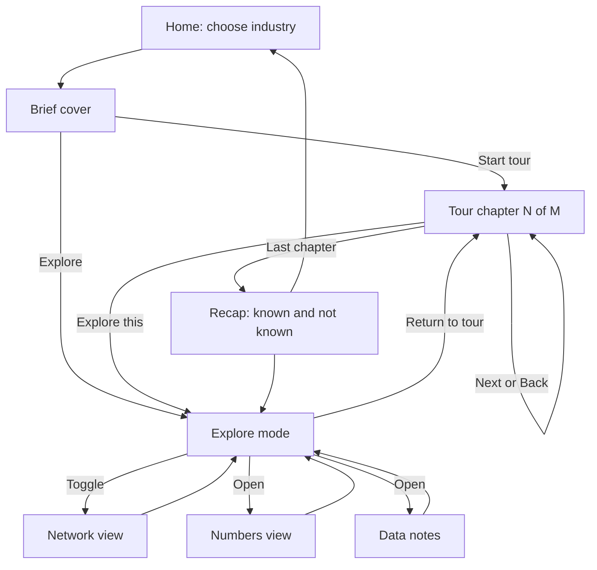
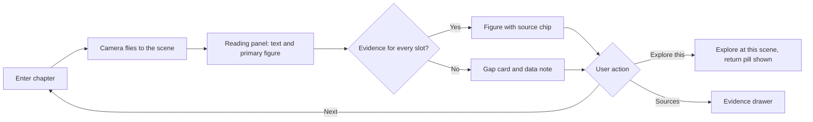
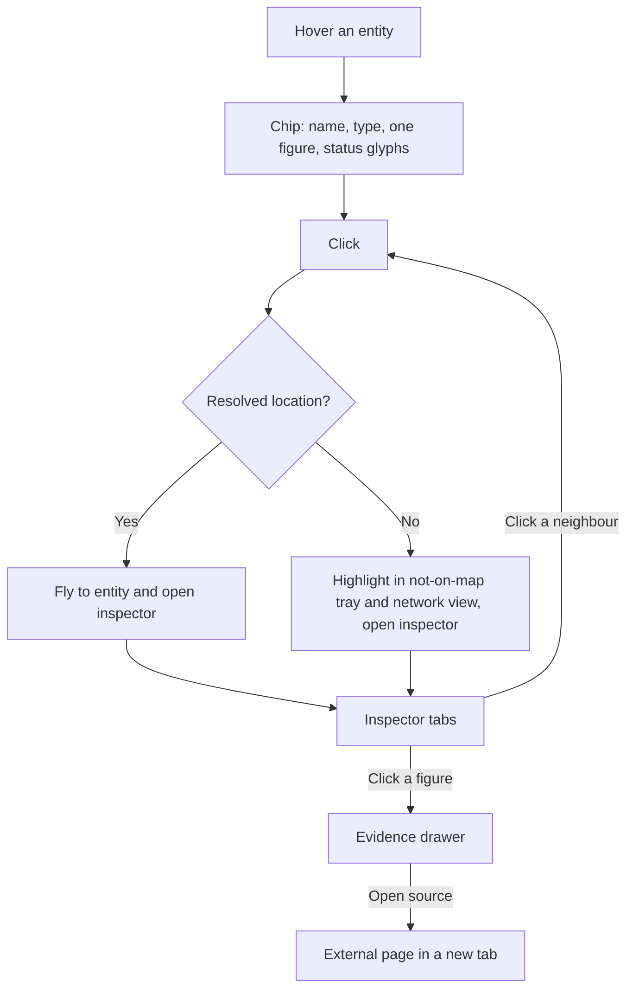
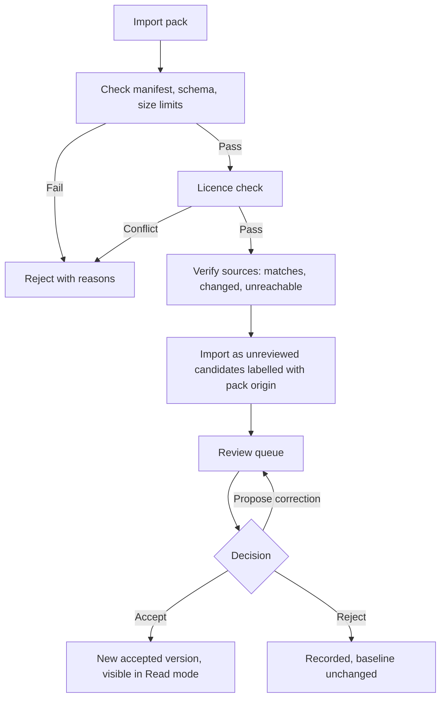
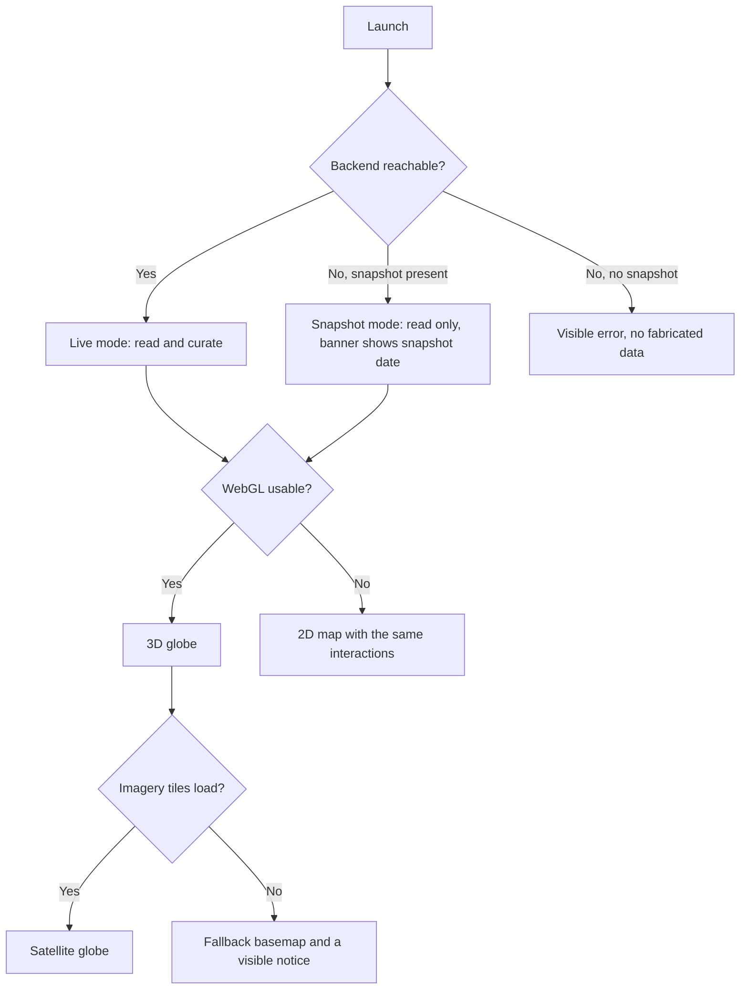

# User interface flows

First-pass draft, 2026-09-23, for the user to critique. Everything here is a **proposal** except the user decisions listed in section 1. Diagrams use Mermaid and render in GitHub or the VS Code Markdown preview.

## 1. Fixed inputs

**User decisions:** dark visual style in the God's Eye tradition; the globe is the centrepiece and stays behind the other screens; tours advance on "next"; desktop first; tours are curated, one per major industry, with some generation for updates.

**User decisions, 2026-09-23 (second round):** an organisation is shown only where it has sourced connections; connections are offered both as a filter over the globe and as a graph view; Curate is a separate route that a public read-only build omits; the corner readouts are on by default and can be toggled off.

**From the principles** (`docs/methodology.md`): every figure shows unit, period, status and source; unknown is shown, never blank; a map point is never a route or a guess.

**Baseline being replaced** (the current app, observed 2026-09-22): tabs for Relationships, Metrics, Geography, Timeline and Reading guide; an entity rail with search; an evidence inspector with review and history; a footer with counts.

## 2. One shell, many states

Nexus is one persistent shell, not a set of pages. The globe never unmounts; panels layer over it. This matches how God's Eye View is built (observed 2026-09-22): left panels for data layers and scenes, right panels for display options and context, a bottom dock, and monospaced HUD readouts in the corners.

| God's Eye region | Nexus role |
|---|---|
| Top-left logo | Brand and industry switcher |
| Top-right buttons | Search (Ctrl+K), share link, mode toggle, settings |
| Left panels (layers, scenes) | Brief: chapter rail. Explore: layers and category filters |
| Right panels (display, context) | Brief: reading panel. Explore: entity inspector |
| Bottom dock | Time control (only where data supports it), data notes chip, chat later |
| Corner HUD readouts | **Epistemic readouts**: data as-of date, pack version, count of entities not on the map, precision of the selection |
| Bottom-right "power up" chip | Data notes and installed packs |

Reusing the HUD corners for provenance turns God's Eye's signature decoration into the place where the honesty vocabulary lives.

```
┌─────────────────────────────────────────────────────────────────────────┐
│ ◇ NEXUS  Oil ▾            [ Brief | Explore ]        ⌕ Ctrl+K   ⤴   ☰  │
│ AS OF 2026-09-10 · PACK oil 1.0                       3 DATA NOTES ▸    │
│ ┌─────────┐                                            ┌──────────────┐ │
│ │ Chapters│          ( GLOBE, always behind )          │ Reading /    │ │
│ │  or     │                                            │ Inspector    │ │
│ │ Layers  │                                            │              │ │
│ └─────────┘                                            └──────────────┘ │
│ ◂ ────────────●────────── time (only where data supports it)  LAYERS ▸ │
│ NO FIX: 4 entities not on map ▸                     PRECISION: coarse   │
└─────────────────────────────────────────────────────────────────────────┘
```

## 3. Where today's features go

| Today | New home |
|---|---|
| Geography tab | The globe itself, always present |
| Relationships tab | Network view, a toggle over the globe, sharing one selection state |
| Metrics tab | Numbers view, a full-width panel over a dimmed globe |
| Timeline tab | History chapter and the time control |
| Reading guide | The guided tour |
| Evidence inspector | Entity inspector plus evidence drawer |
| Review and version history | Curate mode, kept out of the learner's view |

## 4. Screens and states

1. **Home.** Choose an industry. Cards show name, one line, pack version, data as-of date and "chapters with evidence: 7 of 9" (counts, not a percentage). Resume last position.
2. **Brief cover.** What the industry is in two sentences, chapter list, and two buttons: Start tour, Explore.
3. **Tour chapter.** Chapter rail, reading panel (a few short paragraphs, one primary figure, a sources link), camera flies to the chapter's scene. Next and Back; arrow keys.
4. **Recap.** Closes the tour with what is now known and, separately, what this brief could not establish.
5. **Explore.** Free globe, hover chips, category filters, search. A "Return to tour" pill appears when entered from a chapter.
6. **Entity inspector.** Tabs: Summary, Numbers, Links, Evidence, History. Header shows type, subtype and status badges.
7. **Evidence drawer.** Opens from any figure: source, locator, verbatim excerpt, dates, verification state (matches, changed, unreachable), rights note.
8. **Network view.** The relationship graph, with the globe dimmed behind it. Needed because materials, industries and most organisations have no map location. It shares its selection and filters with the globe (see section 5).
9. **Numbers view.** Charts chosen by data shape, each with unit, period, status and sources.
10. **Data notes.** The list of gaps and conditions for this industry (see `docs/frontend-rebuild.md`).
11. **Curate mode.** Review queue, proposal editor, pack import and verification results. Absent from a public read-only build.
12. **Packs and settings.** Installed packs, versions, licences and updates.
13. **Chat.** Later. A docked panel calling the same action verbs.

## 5. What gets drawn on the globe, by category

- **Place** (country, region, chokepoint): marker, or a region fill where only region precision exists.
- **Facility** (mine, smelter, terminal): point icon.
- **Infrastructure** (pipeline, rail): line, only where sourced geometry exists.
- **Organisation** (companies, groups): **not pinned.** A headquarters point must not stand in for an unknown factory. Companies appear in "Who's who" cards and in the network view; hovering one highlights its linked facilities on the globe. An organisation with no sourced connection is not shown at all; published briefs already reject isolated entities. Connections decide whether a record is complete, not how important it is: prominence still comes from the significance model, because `AGENTS.md` rules out ranking by graph degree. **Refinement pending** (from the technical review): the isolation rule must never push anyone to invent a relation just to pass validation. A registry entry may instead carry an explicit "context-only" or "unresolved" reason and be excluded from the default display.
- **Material and industry:** never on the map. They live in the network view and in panels.

Level of detail: default shows entities of the top display tier; zooming reveals more. Tier comes from the significance model in `docs/frontend-rebuild.md`, so a stated criterion decides prominence.

### Connections on the globe versus in the graph

Both are offered, as two presentations of one shared selection and filter state.

- **On the globe: highlight, never draw.** Selecting an entity dims everything outside its neighbourhood and puts a halo on the related entities that have a location, with the rest listed in the panel. No lines are drawn between them, because a line on the globe reads as a route or flow, which is not sourced. Lines appear only where sourced geometry exists.
- **In the graph: schematic lines are fine**, because the graph is explicitly non-geographic. It opens focused on the selection and one hop out, with a control for two hops and filters by category.
- **The whole picture** is an overview mode that collapses by category and shows only the top display tier. Without that, a graph of the shared registry becomes the crowded picture the user described from earlier experience.
- Selecting in either place selects in both.

## 6. Flows

### 6.1 Navigation



Search (Ctrl+K), share and the mode toggle are available from every state.

### 6.2 One tour chapter



### 6.3 Hover, click and evidence



### 6.4 Curator: importing and reviewing a pack



### 6.5 Launch and degradation



The 2D fallback and the "no fabricated data" rule already exist in the current app and its tests, and must survive the rebuild.

## 7. Shared state and the action verbs

Every user action is a verb on the shared action layer (`docs/frontend-rebuild.md`), so mouse, tour and a future chat agent behave identically.

| UI action | Verb (draft) |
|---|---|
| Click or search result | `select_entity(id)` |
| Chapter change, "fly to" | `focus_camera(scene)` |
| Category or layer toggle | `set_layers(...)` |
| Time control | `set_as_of(date)` |
| Number click | `open_evidence(claim_or_metric_id)` |
| Next, Back, Return to tour | `go_chapter(id)`, `return_to_tour()` |
| Map or Network toggle | `set_view(map or network)` |

A share link encodes: industry, pack versions, mode, chapter, selection, camera, as-of date and layers. It carries no personal data.

## 8. Missing-data states in the interface

Defined in `docs/frontend-rebuild.md`. In the shell: the corner readout counts entities not on the map; hover chips carry glyphs for estimate, forecast, coarse and unverified; a chapter lacking evidence shows a gap card instead of a blank; the data notes list is the same records the curator works from.

## 9. Keyboard and accessibility (desktop first)

Left and right arrows change chapters, Esc closes the top layer, `/` or Ctrl+K opens search. Status uses an icon plus text, never colour alone. Motion respects reduced-motion settings, and post-processing effects (bloom, sensor looks) are optional and off by default.

## 10. Open questions

- What does the halo look like, and how many related entities can it carry before it stops being readable?
- In the graph overview, what exactly collapses: by category, by tier, or both?
- What does a "Who's who" card contain, given companies are not on the map?
- Which tour chapters need a full-width non-map treatment, if any?
- Which readouts should the corners carry first, and which can wait?
