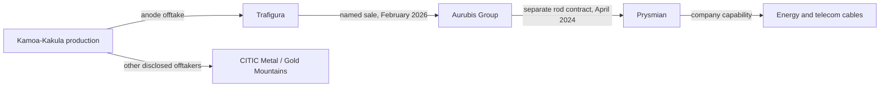

# Pilot 01 — From Kamoa copper to cable manufacturing

Research date: 2026-09-15. **Feasible for a descriptive investigation; incomplete for physical traceability or quantitative impact prediction.** No Nexus application or model evaluation has been run.

## Investigation question

What can public evidence establish about Kamoa-Kakula's production, its 2025 disruption, and the commercial connections leading toward downstream cable manufacturing?

Chosen because it connects to the user's podcast, exposes real changes over time, and has named counterparties. Initial Kennecott/Southwire and Olympic Dam/Nexans searches did not immediately establish a strong direct link, so the pilot followed the richer Kamoa disclosures. This was a practical selection, not an exhaustive comparison.

The user accepted the proposed React/TypeScript + Python/FastAPI + PostgreSQL modular-monolith baseline and authorized this feasibility investigation. Application implementation and paid API usage have not started.

## What the trail establishes

These are dated commercial/production relationships, **not a proven chain of custody for one lot of copper**. The Trafigura group disclosure and the Trafigura Asia legal counterparty are retained separately in the fixture.

- **Named sale:** Trafigura identifies Aurubis as the purchaser of Kamoa anodes. At announcement, the goods had reached its Kolwezi dry port; onward transport remained planned. [S06]
- **Progress update:** Ivanhoe subsequently reported arrival at Lobito during Q1, while European arrival remained forecast for May. Matching these reports to a precise cargo ID remains unresolved. [S08]
- **Downstream agreement:** Aurubis and Prysmian disclose a long-term wire-rod agreement particularly serving European plants. Neither named receiving factories nor contract quantities/expiry are established by these releases. [S09–S11]
- **Transformation:** Aurubis describes producing cathodes and then products including wire rod; rod is a precursor for cable. This is company/process context, not proof of a Kamoa-to-Prysmian material transfer. [S12–S13]

## A real news-and-history test

| Document | What we can encode | What we must not infer |
| --- | --- | --- |
| June 11, 2025, Ivanhoe [S02] | Western Kakula restart on June 7; first anode forecast for October | Complete restart or actual October anode output |
| June 13, 2025, Zijin filing [S03] | Flooding following pumping damage; changed production guidance | Independent confirmation from an unrelated observer |
| January 2, 2026, Ivanhoe [S05] | First anodes produced December 29, 2025; acid by-product | Current full capacity or every projection fulfilled |
| February 19, 2026, Trafigura [S06] | Sale and arrival at dry port; subsequent route planned | Arrival at an identified European refinery |
| April 13, 2026, Ivanhoe [S08] | Q1 Lobito arrival; European arrival expected in May | May receipt actually happened |

The filing's former and revised guidance ranges are projections, not actual lost production. Do not subtract them and label the difference a measured loss. A forecast missed by later outcomes is not necessarily a correction of an originally false report.

## Feasibility matrix

| Data needed | Result | MVP treatment |
| --- | --- | --- |
| Named companies and product forms | Good public documentation | Stable IDs; distinct concentrate, anode, cathode and rod |
| Mine disruption and partial recovery | Dated producer/JV disclosures | Attributed events; site-level scope |
| Commercial buyers | Several explicitly named | Contract/sale relations with source dates |
| Continuous end-to-end material lineage | Not established | Visible gap; no implied batch tracing |
| Exact receiving factories | Not established | Company-level nodes; no invented map points |
| Production versus forecasts | Available but mixed in prose/headlines | Separate metric, basis, period and claim type |
| Logistics | Named corridor and port; reported milestones | Milestone timeline, no live position or precise route geometry |
| Operational dependence / lost downstream output | Not established | Unknown; do not infer from graph reachability |
| Multilingual versions | English, Portuguese and Italian reviewed | Original excerpts, labelled translations, shared-origin grouping |
| Automated updates | Public HTML/PDF candidates, no ingestion pipeline built | Selected document import first |
| Source redistribution | Public readability established; broad reuse rights not audited | Metadata, short excerpts and authored notes only |
| Historical state | Dated disclosures available | Publication-time reconstruction; actual ingestion time retained |

## Evidence and data quality findings

- S09, S10 and S11 reproduce a joint commercial announcement across publishers/languages. They strengthen attribution to counterparties but are not three independent investigations.
- S06/S07 are related participant announcements. S03 is a co-owner filing hosted by an exchange, not an exchange verification of the event.
- The Trafigura headline describes refined copper while its body identifies anodes for subsequent refining. Product classification must use the passage, not the headline alone.
- A Kamoa website copy of a May release contains a truncated sentence and a weekday/date mismatch. It was inspected but excluded from the core sources: https://www.kamoacopper.com/en/underground-mining-activities-at-kakula-mine-suspended-remediation-work-continues-in-western-section-of-kakula/ . This illustrates why raw extraction needs review.
- Copper.org archive pages surfaced useful process explanations in search, but direct opens failed. They are not part of the core evidence pack.
- The operations profile is undated and can change. It supplies geographic context, not a historical snapshot. Exact coordinates are deliberately null in the fixture.
- Most evidence comes from commercially interested participants. Independent physical verification, signed contract texts and shipment-level identifiers were not obtained.

## Files and verification scope

- [evidence-pack.json](evidence-pack.json): 14 source records, 20 entities, 18 source-checked candidate assertions and 6 events. This is a research fixture, not a finalized application schema or an independently verified ground-truth graph.
- [acceptance-cases.json](acceptance-cases.json): 12 authored questions with expected behaviour. No model has been tested on them.
- [access-checks.json](access-checks.json): bounded direct retrieval checks where attempted; distinguishes fetchability from extraction accuracy and reuse rights.

Source passages were manually inspected through the web tool, including two PDF texts. Short quoted anchors and section/page locators are retained. Full documents were not republished. Access checks store response metadata/hashes only; a successful fetch does not validate an ingestion parser. Sources span 2024-04 to 2026-04 plus undated context, not a comprehensive current-state audit.

## First implementation justified by this pilot

Build a small graph/evidence view that follows the named commercial path, explains product transformations and shows the incomplete physical lineage. Add timeline distinctions and the unknown-answer cases before on-demand research.

The full-data fixture remains reviewable and should be easy to replace as schemas evolve. Use an actual PDF parsing spike on S03/S10 to test page locators, line breaks and table handling; that is remaining implementation work. Retain the multilingual releases as deduplication/translation tests. Do not buy shipment data or fabricate missing factories to make the first graph look complete.

**Decision:** proceed with this case for the descriptive MVP. Treat exact material traceability, quantitative downstream exposure and live monitoring as unproven capabilities.

## Source register

- **S01 — [Ivanhoe: January 2025 production guidance and offtake](https://www.ivanhoemines.com/news-stories/news-release/ivanhoe-mines-provides-2024-production-results-2025-production-guidance/)**. Ivanhoe Mines; 2025-01-08; en; HTML. Locator: Offtake section, opening paragraphs.
- **S02 — [Ivanhoe: western Kakula restart](https://www.ivanhoemines.com/news-stories/news-release/ivanhoe-mines-announces-restart-of-underground-mining-operations-on-western-side-of-kakula-mine-on-june-7-2025/)**. Ivanhoe Mines; 2025-06-11; en; HTML. Locator: Opening operational update.
- **S03 — [Zijin: flooding and production guidance](https://www.hkexnews.hk/listedco/listconews/sehk/2025/0613/2025061301243.pdf)**. Zijin Mining; 2025-06-13; en; PDF. Locator: PDF page 1, paragraphs 2-3.
- **S04 — [Ivanhoe: Q2 2025 production and third offtaker](https://www.ivanhoemines.com/news-stories/news-release/ivanhoe-mines-reports-112009-tonnes-of-copper-produced-by-kamoa-kakula-in-q2-2025/)**. Ivanhoe Mines; 2025-07-08; en; HTML. Locator: Offtake section, paragraph beginning In June.
- **S05 — [Ivanhoe: first anode production](https://www.ivanhoemines.com/news-stories/news-release/ivanhoe-mines-announces-first-anode-production-from-kamoa-kakula-copper-smelter/)**. Ivanhoe Mines; 2026-01-02; en; HTML. Locator: Opening dated announcement.
- **S06 — [Trafigura: sale of Kamoa anodes to Aurubis](https://www.trafigura.com/news-and-insights/press-releases/2026/trafigura-aurubis-and-kamoa-copper-complete-first-sale-of-low-carbon-refined-copper-via-the-lobito-atlantic-railway/)**. Trafigura; 2026-02-19; en; HTML. Locator: Opening transaction and logistics paragraphs.
- **S07 — [Lobito Atlantic Railway: Portuguese transaction announcement](https://www.lobitoatlantic.com/pt/noticias-recursos/noticias/trafigura-aurubis-and-kamoa-copper-complete-first-sale-of-low-carbon-refined-copper-via-the-lobito-atlantic-railway/)**. Lobito Atlantic Railway; 2026-02-19; pt; HTML. Locator: Opening paragraph.
- **S08 — [Ivanhoe: Q1 2026 operations and export progress](https://www.ivanhoemines.com/news-stories/news-release/ivanhoe-mines-reports-71417-tonnes-of-copper-in-anode-produced-by-kamoa-kakula-in-q1-2026-recovery-efforts-advancing/)**. Ivanhoe Mines; 2026-04-13; en; HTML. Locator: Logistics paragraph beginning The first shipment.
- **S09 — [Prysmian: Aurubis wire rod contract](https://www.prysmian.com/en/media/press-releases/prysmian-and-aurubis-contract-for-copper-wire-rod)**. Prysmian; 2024-04-23; en; HTML. Locator: Opening two paragraphs.
- **S10 — [Aurubis: joint wire rod contract release](https://www.aurubis.com/dam/jcr:3d203743-a866-456a-b09c-b28a83f6d0e8/Aurubis_Press%20Release_Prysmian%20supply%20contract_20240423.pdf)**. Aurubis; 2024-04-23; en; PDF. Locator: PDF page 1, opening two paragraphs.
- **S11 — [Prysmian: Italian wire rod contract release](https://www.prysmian.com/it/comunicati-stampa/prysmian-e-aurubis-siglano-un-contratto-per-la-fornitura-di-rame-in-vergelle)**. Prysmian; 2024-04-23; it; HTML. Locator: Opening paragraphs.
- **S12 — [Aurubis: company portrait 2022/23](https://annualreport2022-23.aurubis.com/at-a-glance/company-portrait)**. Aurubis; undated / reporting-period context; en; HTML. Locator: Company portrait paragraph; reporting period 2022/23.
- **S13 — [Aurubis: wire rod product explanation](https://www.aurubis.com/en/olen/products/wire-rod)**. Aurubis; undated / reporting-period context; en; HTML. Locator: Basis for sophisticated applications.
- **S14 — [Ivanhoe: Kamoa-Kakula operations profile](https://www.ivanhoemines.com/operations/kamoa-kakula-mining-complex/)**. Ivanhoe Mines; undated / reporting-period context; en; HTML. Locator: Ownership header and location paragraph.

## Direct access and fixture validation results

Four bounded public GET requests succeeded: S02, S06 and S09 returned HTML containing the retained evidence anchor; S03 returned a PDF with the expected file signature. Responses were approximately 82 KB, 38 KB, 191 KB and 167 KB respectively. Full response bodies were discarded after hashing. See access-checks.json for precise sizes, timestamps and final URLs. This demonstrates direct retrieval feasibility for these four documents only; local PDF parsing and automated extraction remain untested.

Offline validation passed for unique source/entity/assertion IDs, graph endpoints, evidence references, event references, acceptance-case references and short-excerpt limits. These structural checks do not constitute application or LLM acceptance tests.
